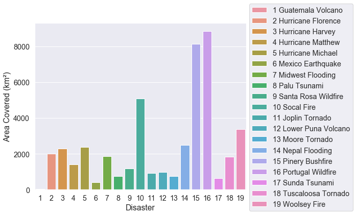
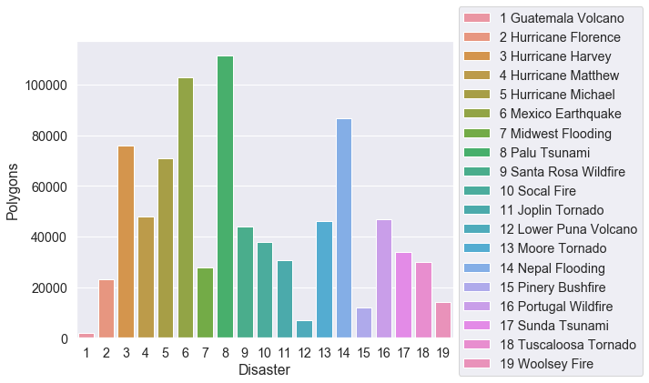
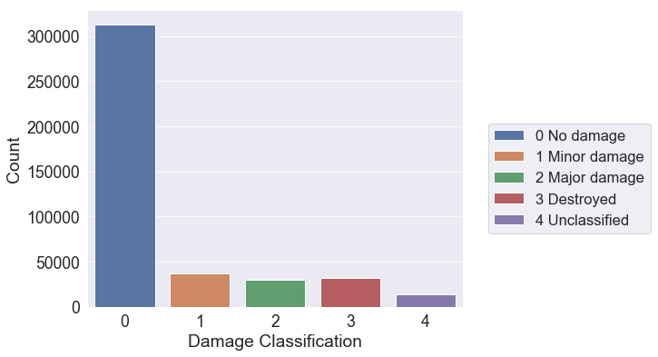
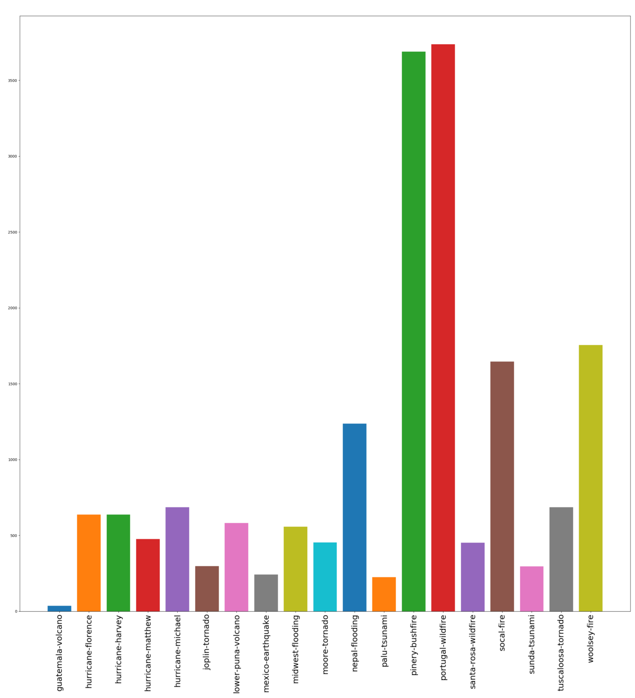
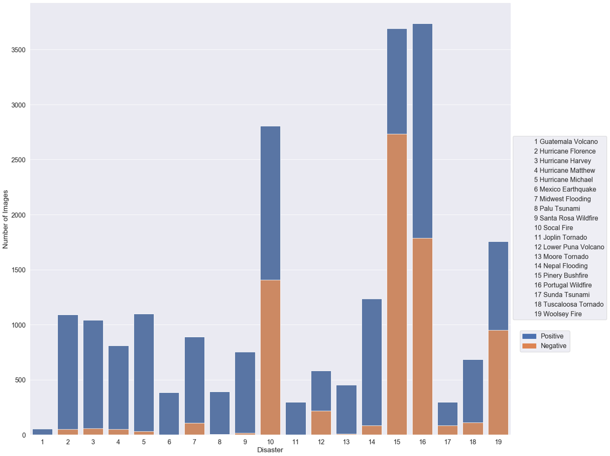
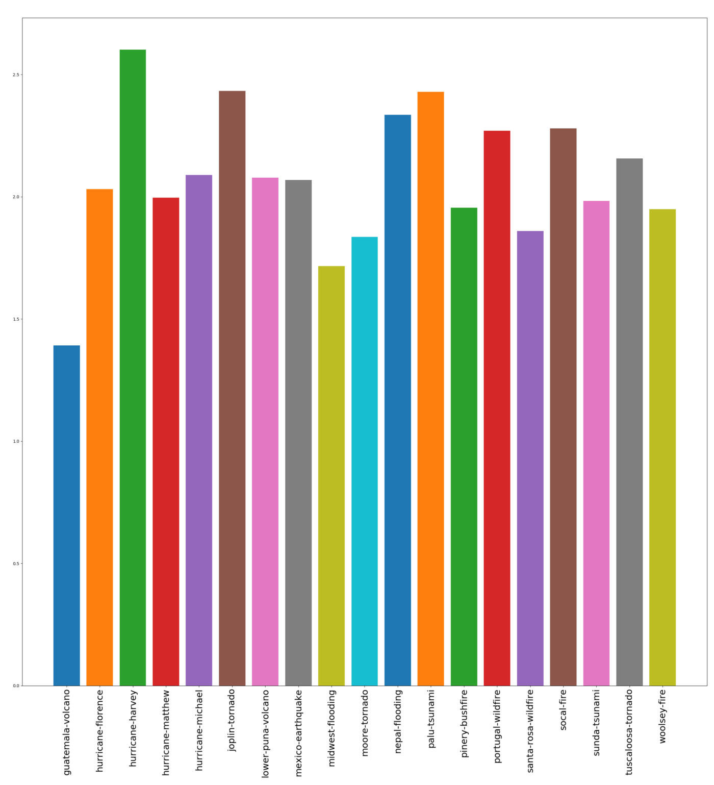

## چالش‌های مربوط به دیتاست *XBD*

1. به شدت *unbalanced* است

محدوده‌ عکس‌های موجود در هر بلای طبیعی

مجموع تعداد اشیا یا ساختمان‌های نشانه گذاری شده در هر بلای طبیعی

تعداد ساختمان‌ها یا اشیا برچسب‌گذاری شده با هر کلاس

تعداد عکس‌های موجود در هر کدام از بلایای طبیعی

2. به ازای هر عکس پس از حادثه، لزوما عکس قبل از حادثه‌ی آن موجود نیست و برعکس

مقایسه‌ی تعداد عکس‌های قبل و بعد از حادثه در هر بلای طبیعی

3. در تصاویر متفاوت دیتاست ما،
*GSD*
یکسان نیست. احتمالا عملکرد مدل روی چنین دیتایی خیلی خوب نباشد و باید دیتا را نرمالایز کرد طوری که *GSD* آن یکسان شود.

- تعریف *GSD*:
به فاصله‌ی دو پیکسل یک تصویر هوایی در روی زمین
[*Ground sample distance*](https://en.wikipedia.org/wiki/Ground_sample_distance)
یا 
*GSD*
گفته می‌شود.
مثلا اگر برای یک عکس 
*GSD*
برابر با ۱.۵ متر باشد یعنی فاصله‌ی هر دو پیکسل از این تصویر بر روی زمین ۱.۵ متر است.

میانگین 
GSD
در بلایای مختلف

4. منبع داده‌ها

داده‌ها هم در 
*Kaggle*
قابل دسترسی هستند و هم از طریق سایت 
[xview2](https://xview2.org/download-links)
با ثبت نام قابل دانلود هستند. نکته عجیب این است که داده‌ها روی 
*Kaggle* 
۲۰ گیگابایت حجم دارند ولی داده‌های روی سایت در یک قسمت
۵۰
گیگ حجم دارند.

## Folder Structre 
- The "train" dataset contains 2799 pairs of high-resolution RGB satellite imagery in PNG format, provided as a 7.8 GB GZIP archive.

-  After you unpack the archive, you should see three directories: images, labels, and targets. Images are RGB PNG images. Labels are JSON files with building annotations (polygons in WKT format) and metadata for the given view. 
- Targets are pixelwise ground truth in the format specified for the xView2 Challenge, which were derived from the underlying polygons.