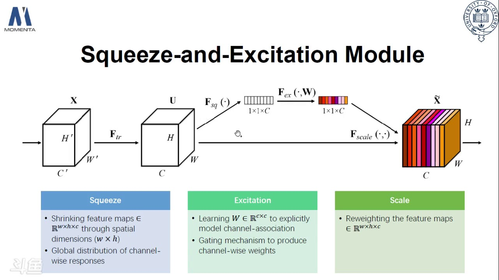
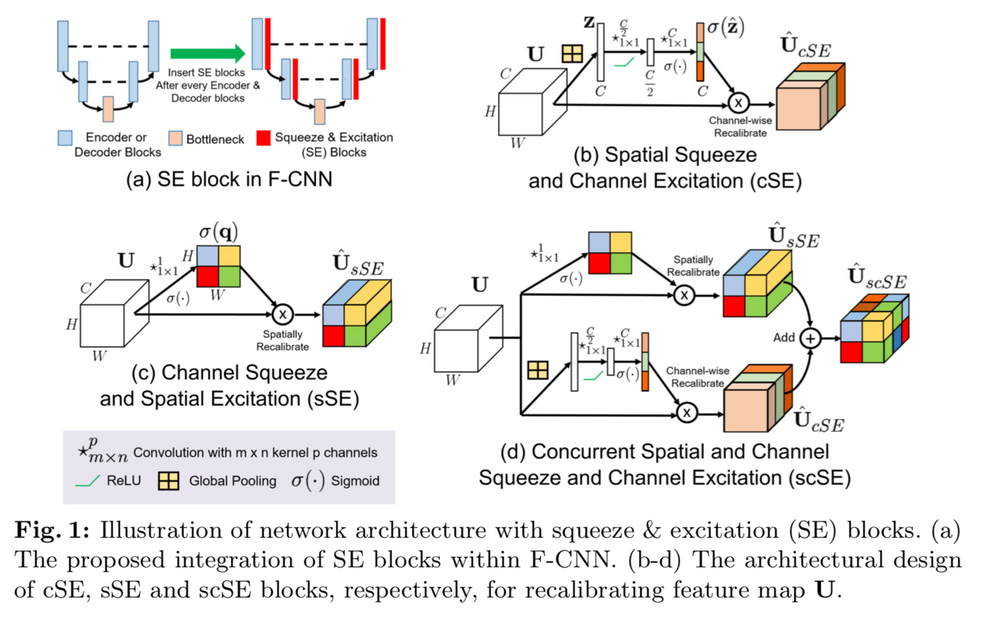

## Dataset

#### Overview of Xview2 Challenge and data

- [XView 2 Challenge | Part 1: Getting Started](https://lezwoncastelino.medium.com/xview-2-challenge-part-1-getting-started-270c2249e19e)

    - definition of [Ground sample distance](https://en.wikipedia.org/wiki/Ground_sample_distance)

- [XView 2 Challenge | Part 2: Setting up Sagemaker](https://lezwoncastelino.medium.com/xview-2-challenge-part-2-setting-up-sagemaker-49090d9167ea)

- [Xivew 2 Dataset MetaData Description](./res/xBD_Metadata_Explanation.pdf)

- [XView 2 Challenge: Part 3: Exploring the Dataset](https://medium.com/analytics-vidhya/xview-2-challenge-part-3-exploring-the-dataset-ec924303b0df)

- [xview2 challenge notebook by *LEZWON CASTELLINO* on kaggle](https://www.kaggle.com/code/lezwon/xview2-challenge/notebook)

- [Xview2 Website](https://xview2.org/download-links)
    - Data has `tier3`, `train` and `test` sets
    - Each set has `images`, `labels` and `targets` folder (`test` has some differences)
    - `tier3` Folder is added to the dataset in the middle of challanges
    - `images` Folder contains *pre-disaster* and *post-disaster* images. filenames are in the format `{disaster-name}_{id}_{pre/post}_disaster.png`
    - **Important Notice**: Some of the post imagary are slightly shifted from their corresponding pre image. also the dataset has different ground sample distances.
    - `labels` folder contains json files containing polygons for each pre/post disaster image. this polygons indicate buildings. in pre disaster images polygons don't have any damage level. but in post disaster images they do. disaster types are `destroyed`, `major-damage`, `minor-damage`, `no-damage`, `un-classified`. the majority of polygons are labeled `no-damage` in post disaster images. so the dataset is highly unbalanced.
    - Distribution of classes in `train` set:
        ```json
        {
            'destroyed': 13227,
            'major-damage': 14161,
            'minor-damage': 14980,
            'no-damage': 117426,
            'un-classified': 2993
        }
        ```
        Distribution of classes in `test` set:
        ```json
        {
            'destroyed': 3775,
            'major-damage': 3850,
            'minor-damage': 4798,
            'no-damage': 41427,
            'un-classified': 1012
        }
        ```

- [Xview2 Challenge Baseline Repository](https://github.com/DIUx-xView/xView2_baseline)
    - Counts `un-classified` damage type as `no-damage`
    - Fine-tunes *Spacenet* to use for localization task.
    - Utilizes *ResNet50* + some colvolutional layers for damage-classification task.
    - The classification task uses the bounding box of polygons + a scaling factor to build input images. then resizes them to $128*128$ and feeds them into the classification network.
    - First stage of each pipeline is to distribute images and label files into different folders based on their disaster. for example:

        `guatemala-volcano_00000000_post_disaster.png` 

        moves to 
        
        `guatemala-volcano/00000000_post_disaster.png`

    - Its a baseline repository so it contains no useful methodology and it's models have low performance.

## Methodology
- [XView2 Challenge First Places Solution Repository](https://github.com/DIUx-xView/xView2_first_place)
    - Counts `un-classified` damage type as `no-damage`
    - **Important:** They provide a link to model weights on amazon s3. but the link returns *Access Denied* maybe they give us the correct link if we contact them by email.
    - Frist, localization models trained using only "pre" images to ignore this additional noise from "post" images. Simple UNet-like segmentation Encoder-Decoder Neural Network architectures used here.
    - Then, already pretrained localization models converted to classification Siamese Neural Network. So, "pre" and "post" images shared common weights from localization model and the features from the last Decoder layer concatenated to predict damage level for each pixel. This allowed Neural Network to look at "pre" and "post" separately in the same way and helped to ignore these shifts and different nadirs as well.
    - Morphological dilation with 5*5 kernel applied to classification masks. Dilated masks made predictions more "bold" - this improved accuracy on borders and also helped with shifts and nadirs.
    - Predictions averaged with equal coefficients for both localization and classification models separately.
    - Classification models initilized using weights from corresponding localization model and fold number. They are Siamese Neural Networks with whole localization model shared between "pre" and "post" input images. Features from last Decoder layer combined together for classification. Pretrained weights are not frozen. Using pretrained weights from localization models allowed to train classification models much faster and to have better accuracy. Features from "pre" and "post" images connected at the very end of the Decoder in bottleneck part, this helping not to overfit and get better generalizing model.
    - The code for *SENet* is likely borrowed from [this repository](https://github.com/TencentYoutuResearch/PersonReID-YouReID), but some modules like *SCSE Module* are new.

- [An Introduction to different Types of Convolutions in Deep Learning](https://towardsdatascience.com/types-of-convolutions-in-deep-learning-717013397f4d)
    - depthwise separable convolution are used because of the hypothesis that spatial and depthwise information can be decoupled. for example in Xception model.

- *Squeeze-and-Excitation (cSE)* networks
    
    - [Squeeze-and-Excitation Networks](https://towardsdatascience.com/squeeze-and-excitation-networks-9ef5e71eacd7)
        - some sort of attention module
        - In it’s most basic form this could mean adding a single parameter to each channel and giving it a linear scalar how relevant each one is.
        - Here they use fully connected layers to build SE modules but in the code they use *Conv2D* to build SE modules
    - :page_facing_up:[Squeeze-and-Excitation Networks Paper](https://arxiv.org/pdf/1709.01507.pdf)
    - [A github implementation](https://github.com/ai-med/squeeze_and_excitation)
    - [ ] [Detailed Explaination for above paper](https://blog.paperspace.com/channel-attention-squeeze-and-excitation-networks/)

- *SCSE Module*
    
    - :page_facing_up: [Concurrent Spatial and Channel ‘Squeeze &
Excitation’ in Fully Convolutional Networks](https://arxiv.org/pdf/1803.02579.pdf)
    - Detailed Explaination of above paper: [Concurrent Spatial and Channel Squeeze & Excitation (scSE) Nets](https://blog.paperspace.com/scse-nets/)

- What is a Deep Residual Network?
    - [Understand Deep Residual Networks — a simple, modular learning framework that has redefined state-of-the-art](https://medium.com/@waya.ai/deep-residual-learning-9610bb62c355)
    - [Introduction to ResNets](https://towardsdatascience.com/introduction-to-resnets-c0a830a288a4)

- Resnet architecture
    - :page_facing_up: [Deep Residual Learning for Image Recognition](https://arxiv.org/pdf/1512.03385.pdf)

## TO READ

- `learn2learn` [repository](https://github.com/learnables/learn2learn) (mentioned techniques about meta-learning)

- other methodologies
    - :page_facing_up: [Building Disaster Damage Assessment in Satellite Imagery with Multi-Temporal Fusion](https://arxiv.org/pdf/2004.05525.pdf)

- [ ] :page_facing_up: [Recalibrating Fully Convolutional Networks with
Spatial and Channel ‘Squeeze & Excitation’ Blocks](https://arxiv.org/pdf/1808.08127.pdf) 
    - *Concatenation* and *Max-Out* are better strategies in last part of SCSE modules compared to *Addition* or *Multiplication*
    - Adding SE blocks to encoder and decoder layers is recommended compared to adding them to only encoder/decoder layers or classification layer


- [ ] Resnext architecture
    - :page_facing_up: [Aggregated Residual Transformations for Deep Neural Networks](https://arxiv.org/pdf/1611.05431.pdf)

- [ ] Dual Path Networks Architecture

- [ ] Unet Architechture
    - :page_facing_up: [U-Net: Convolutional Networks for Biomedical
Image Segmentation](https://arxiv.org/pdf/1505.04597.pdf)

- [ ] [SpaceNet 4: Off-Nadir Building Footprint Detection Challenge](https://github.com/SpaceNetChallenge/SpaceNet_Off_Nadir_Solutions/tree/master/cannab)

- [ ] [Squeeze and Excitation Networks Explained with PyTorch Implementation](https://amaarora.github.io/2020/07/24/SeNet.html)